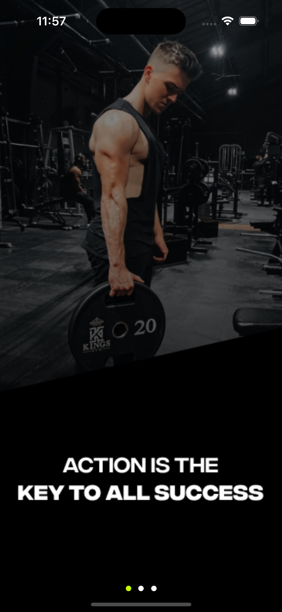
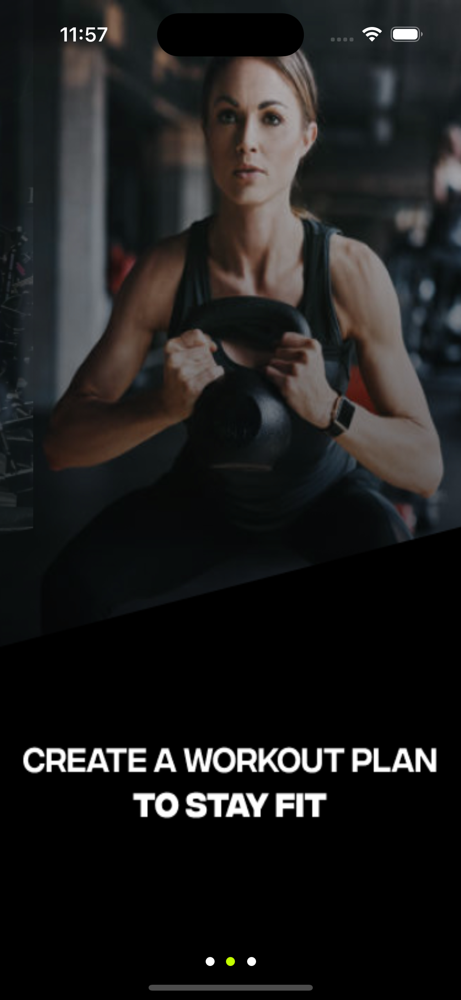
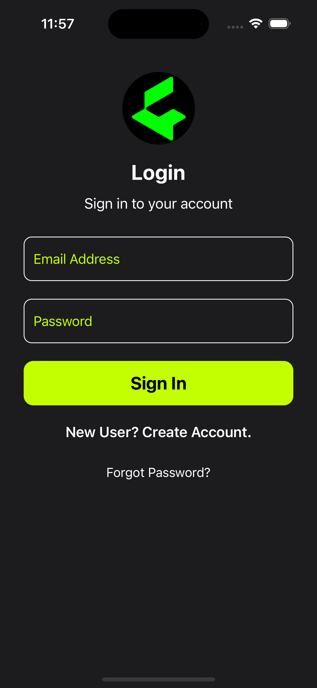
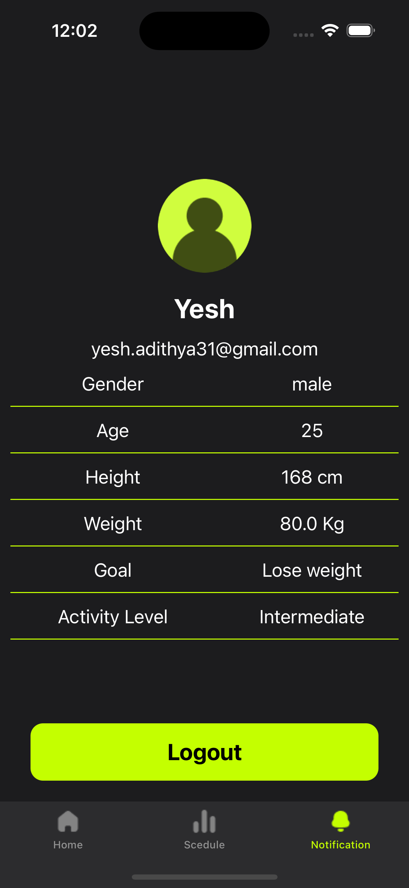
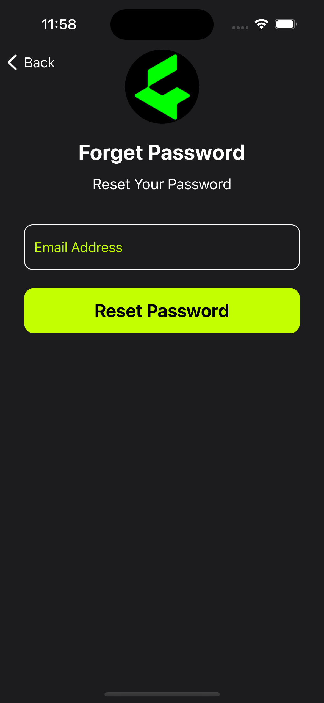
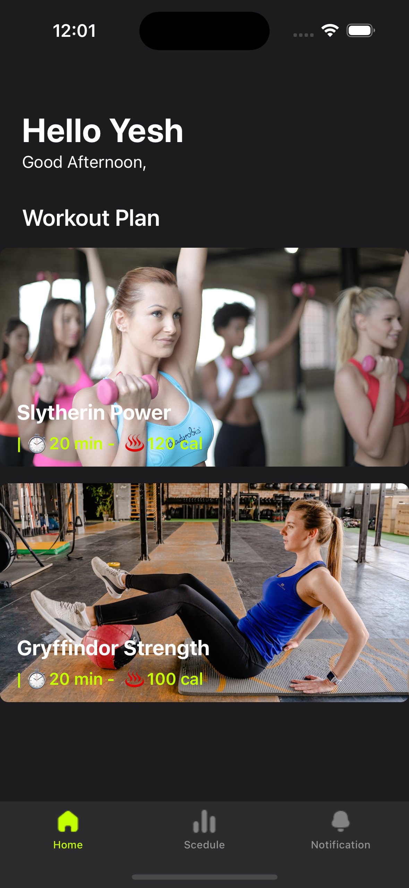
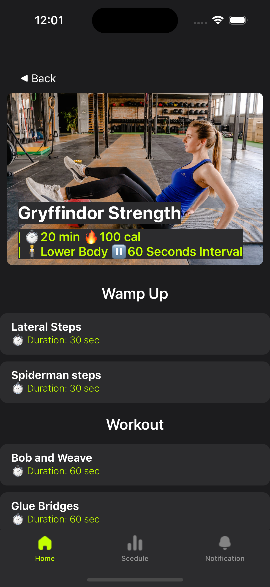
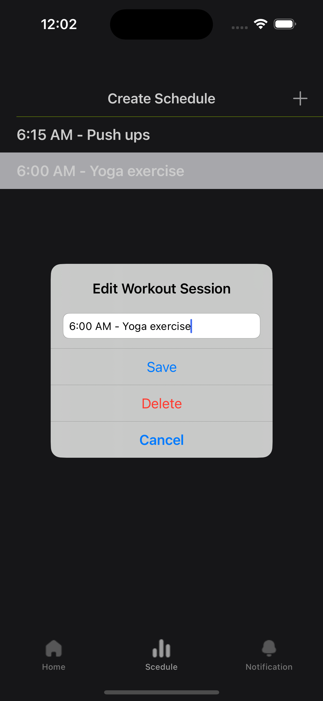

<!-- ABOUT THE PROJECT -->

## About The Project

### SWIFT UIkit Fitness App With Firebase
How It works:
- Splash Screens
  

    
    
    
  

- Login, Registration, ForegetPassword Screen
  

    
    
    
  

- Home Screen, Excercise View, Create Schedule Screen
  

    
    
    
  

(<a href="#readme-top">back to top</a>)

### Built With

This is iOS Application development using SWIFT UIkit and Firebase Firestore Database.

- [![UIKit integration-document][uikit]][uikit]
- ![SWIFT][SWIFT]
- ![Firebase][Firebase]

(<a href="#readme-top">back to top</a>)

<!-- GETTING STARTED -->

## Getting Started

### Prerequisites

Install Xcode:

(<a href="#readme-top">back to top</a>)

<!-- MARKDOWN LINKS & IMAGES -->

[UIKit integration-document]: https://developer.apple.com/documentation/swiftui/uikit-integration/
[SWIFT]: https://img.shields.io/badge/swift-D9624D?style=for-the-badge&logo=swift&logoColor=white
[Firebase]: https://img.shields.io/badge/firebase-black?style=for-the-badge&logo=firebase&logoColor=FFCA27
[uikit]: https://img.shields.io/badge/uikit-white?style=for-the-badge&logo=uikit&logoColor=1F8AE6

